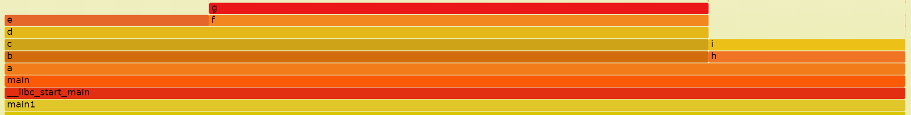

# Game-Tricks

     :smile:

<!-- TOC -->

- [Game-Tricks](#game-tricks)
  - [客户端](#客户端)
    - [场景](#场景)
      - [NO.1 在圆内随机生成点](#no1-在圆内随机生成点)
      - [NO.2 跑马灯](#no2-跑马灯)
      - [NO.3 虚拟摇杆](#no3-虚拟摇杆)
      - [NO.4 小地图](#no4-小地图)
      - [NO.5 聊天框](#no5-聊天框)
    - [图形学](#图形学)
      - [Light 光照](#light-光照)
      - [Xray 透视](#xray-透视)
    - [算法](#算法)
      - [AStar 寻路算法](#astar-寻路算法)
      - [FSM 状态机](#fsm-状态机)
      - [Manager 管理类(Audio、Pool、Scene...)](#manager-管理类audiopoolscene)
    - [架构](#架构)
  - [服务端](#服务端)
    - [C/C++](#cc)
      - [Lua下载](#lua下载)
      - [C++调用Lua](#c调用lua)
      - [Lua调用C++](#lua调用c)
    - [Lua](#lua)
      - [面向对象](#面向对象)
      - [垃圾回收](#垃圾回收)
      - [高性能Lua](#高性能lua)
      - [字节码](#字节码)
      - [其他](#其他)
    - [游戏库](#游戏库)
      - [热更新](#热更新)
      - [序列化](#序列化)
      - [运算](#运算)
    - [性能优化](#性能优化)
      - [火焰图](#火焰图)
      - [Postman](#postman)
      - [Jmeter](#jmeter)
      - [VSCode](#vscode)

<!-- /TOC -->

## 客户端

### 场景

#### NO.1 在圆内随机生成点

圆内的笛卡尔方程：


极坐标：


随机点(x, y)：


<!--
    x^2 + y^2 <= r^2
    x^2 + y^2 = random * r^2
    \rho = \sqrt{random} * r
    \theta = 2 * \pi * random
    x = x = x\_center %2b \rho * cos(\theta)
    y = y\_center %2b \rho * sin(\theta)
-->

#### NO.2 跑马灯

1. 原理
> * 跑马灯有区域限制，超出这个区域就不显示，这里我们用`Mask遮罩`实现。
> * 以水平跑马灯为例：跑马灯的可视范围是背景宽度，文字从右边开始到左边结束，总共移动的距离是`背景宽度 + 文字宽度`。
> * 跑马灯的动画实现使用了[`DOTween插件`](https://assetstore.unity.com/)。

1. 前期准备
> * 新建一个Image作为背景。调整适当大小。
> * 背景下再新建一个Image。添加Mask组件，用于遮住背景之外的文字，Rect Transfrom设置为Stretch，四维全部设置为0，铺满背景。
如果是水平滚动的将Rect Transform的Pivot设置为`1 0.5`，令Mask锚点位于`右边`。
如果是垂直滚动的将Rect Transform的Pivot设置为`0.5 0`，令Mask锚点位于`下边`。
> * Mask下创建Text，随意写些文字，居中显示，添加Content Size Fitter。
如果是水平滚动的将`Horizontal Fit`设置为Preferred Size，将Rect Transform的Pivot设置为`0 0.5`，令Text锚点位于Mask处，方便实现从右往左动画。
如果是垂直滚动的将`Vertical Fit`设置为Preferred Size，将Rect Transform的Pivot设置为`0.5 1`，令Text锚点位于Mask处，方便实现从下往上动画。

#### NO.3 虚拟摇杆

1. `定义委托`
public delegate void JoyStickTouchBegin(Vector2 vec);  // 定义触摸开始事件委托
public delegate void JoyStickTouchMove(Vector2 vec);  // 定义触摸过程事件委托
public delegate void JoyStickTouchEnd();  // 定义触摸结束事件委托
2. `注册事件`
public event JoyStickTouchBegin OnJoyStickTouchBegin;  // 注册触摸开始事件
public event JoyStickTouchMove OnJoyStickTouchMove;  // 注册触摸过程事件
public event JoyStickTouchEnd OnJoyStickTouchEnd;  // 注册触摸结束事件
3. `使用接口`：PointerDownHandler, IPointerUpHandler, IDragHandler  
public void OnPointerDown(PointerEventData eventData)  // 触摸开始  
public void OnPointerUp(PointerEventData eventData)  // 触摸结束  
public void OnDrag(PointerEventData eventData)  // 触摸过程  
4. `返回摇杆的偏移量`  

```C#
private Vector2 GetJoyStickAxis(PointerEventData eventData)
{
    // 获取手指位置的世界坐标
    Vector3 worldPosition;
    if (RectTransformUtility.ScreenPointToWorldPointInRectangle(selfTransform,
             eventData.position, eventData.pressEventCamera, out worldPosition))
        selfTransform.position = worldPosition;
    // 获取摇杆偏移量
    Vector2 touchAxis = selfTransform.anchoredPosition - originPosition;
    // 摇杆偏移量限制
    if (touchAxis.magnitude >= JoyStickRadius)
    {
        touchAxis = touchAxis.normalized * JoyStickRadius;
        selfTransform.anchoredPosition = touchAxis;
    }
    return touchAxis;
}
```

#### NO.4 小地图

> * `UI准备`：Mask圆形遮罩，Minimap小地图边框。
> * 添加一个新的相机，并命名为`Mini Camera`。然后将该相机设为 Player 的子对象，position设为(0, 10,0)，rotation设为(90, 0, 0)。
> * 渲染到UI层需要用到Render Texture来实现。依次点击菜单项Assets -> Create -> Render Texture新建Render Texture，并命名为`Minimap Render`。选中Mini Camera后将Target Texture设为Minimap Render。
> * 下面新建Canvas来添加UI元素。新建Raw Image，命名为`Map`，将Texture设为Minimap Render。
> * 下面新建Image，命名为`Mask`，为其添加Mask组件，并将Image的Source Image设为上面的圆形遮罩。最后将Map设为Mask的子对象。
> * 下面新建Image，命名为`Outline`，将Image的Source Image设为上面的小地图边框。
> * 为了让整个小地图移动起来更方便，新建一个空的GameObject命名为`Minimap`，并将所有对象设为Minimap子对象。
> * 最后层级如下：  
`Minimap`  
---- `Mask`  
-------- `Map`  
---- `Outline`  

#### NO.5 聊天框

> * 重点难点：  
1.需要控制别人和自己聊天框Item的位置  
2.需要控制聊天框ScrollView的滚动  
3.需要控制聊天框Item的宽度高度  
4.需要控制聊天框ScrollView的伸长  
5.需要移除历史聊天框Item  
> * 基本UI组件有玩家输入框、发送按钮、聊天框Item、聊天框ScrollView。
> * 聊天框Item有left和right两种，分别是别人和自己，以自己的聊天框right为例子:  
1.新建一个Image作为`背景`，设置Anchor为(right, top)、Pivot为(1, 1)。  
2.在背景下新建一个Image作为`头像`，设置Anchor为(right, bottom)和一个Text作为`文字`。  
3.在头像下新建一个Text作为`名字`，设置Anchor为(right, middle)。  
4.挂上ChatUI脚本，专门控制UI显示。
5.将其制作成为Prefab，聊天框left同理。  
> * 聊天框ScrollView：  
新建一个ScrollView，设置Anchor为(stretch, stretch)，调整为适当大小。  

### 图形学

#### Light 光照

1. Lambert（兰伯特）：漫反射


2. Half-Lambert（半-兰伯特）：漫反射优化


3. Phong（冯氏）：高光反射


4. Blinn-Phong（布林-冯氏）：高光反射优化


<!--
    I_{diff} = K_d \ast I_l \ast (N \cdot L)
    I_{diff} = K_d \ast I_l \ast (\alpha (N \cdot L) + \beta
    I_{spec} = K_s \ast I_l \ast (V \cdot R)^{n_s}
    R = 2 \ast (N \cdot L) \ast N - L
    I_{spec} = K_s \ast I_l \ast (N \cdot H)^{n_s}
    H = \frac{L %2b V}{\vert L %2b V \vert}
-->

#### Xray 透视

第一遍透视绘制：ZWrite Off、Greater。（关闭深度缓存）

第二遍正常绘制：ZWrite On、LEqual。

### 算法

#### AStar 寻路算法

- 估价函数：f(n) = g(n) + h(n)
- g(n)：从起点到节点n的最短路径。
- h(n)：从节点n到终点的最短路径的启发值。
- 曼哈顿距离：h(n) = x + y
- 特殊情况：当h(n)等于0时，A*算法等于Dijkstra算法。

```C++
while(OPEN!=NULL)
{
    从OPEN表中取f(n)最小的节点n;
    if(n节点==目标节点)
        break;
    for(当前节点n的每个子节点X)
    {
        计算f(X);
        if(XinOPEN)
            if(新的f(X)<OPEN中的f(X))
            {
                把n设置为X的父亲;
                更新OPEN表中的f(n);
            }
        if(XinCLOSE)
            continue;
        if(Xnotinboth)
        {
            把n设置为X的父亲;
            求f(X);
            并将X插入OPEN表中;//还没有排序
        }
    }//endfor
    将n节点插入CLOSE表中;
    按照f(n)将OPEN表中的节点排序;//实际上是比较OPEN表内节点f的大小，从最小路径的节点向下进行。
}//endwhile(OPEN!=NULL)
```

#### FSM 状态机

- public enum Transition // 状态转换条件

```C#
NullTransition = 0
FindPlayer = 1
LosePlayer = 2
```

- public enum StateId // 状态唯一标识

```C#
NullStateId = 0
Patrol = 1
Chase = 2
```

- public abstract class FSMState // State基类

```C#
private Dictionary<Transition, StateId> transDict; // Transition字典
public StateId stateId; // State Id
public FSMSystem fsm; // 状态机
...
public void AddTransition(Transition trans, StateId id); // 添加Transition
public void RemoveTransition(Transition trans); // 移除Transition
public StateId GetState(Transition trans); // 获取State
public virtual void DoBeforeEnter() { } // 进入State之前
public virtual void DoBeforeExit() { } // 退出State之前
public abstract void DoUpdate(); // 在State中
```

- public class FSMSystem // 状态机系统

```C#
private Dictionary<StateId, FSMState> stateDict; // State字典
public FSMState currentState; // 当前State
...
public void AddState(FSMState state); // 添加State
public void RemoveState(FSMState state); // 移除State
public void DoTransition(Transition trans); // 执行Transition
public void StartState(StateId id); // 开始State
```

- public class NPCController // NPC控制器...
- public class ChaseState // 追逐状态...
- public class PatrolState // 巡逻状态...
- public class PlayerMove // 角色移动...
- public class FollowPlayer // 跟随角色...

#### Manager 管理类(Audio、Pool、Scene...)

- Singleton（普通单例）

```C#
public abstract class Singleton<T>
    where T : new()
{
    private static T _instance;
    private static object _lock = new object();
    public static T Instance
    {
        get
        {
            if (_instance == null)
            {
                // 上锁，防止重复实例化
                lock (_lock)
                {
                    if (_instance == null)
                    {
                        _instance = new T();
                    }
                }
            }
            return _instance;
        }
    }
}
```

- UnitySingleton（组件单例）

```C#
public class UnitySingleton<T> : MonoBehaviour
    where T : Component
{
    private static T _instance;
    public static T Instance
    {
        get
        {
            if (_instance == null)
            {
                // 利用反射创建 Unity 物体
                _instance = FindObjectOfType(typeof(T)) as T;
                if (_instance == null)
                {
                    GameObject obj = new GameObject();
                    // 利用反射创建 Unity 组件
                    _instance = obj.AddComponent(typeof(T)) as T;
                }
            }
            return _instance;
        }
    }

    public virtual void Awake()
    {
        DontDestroyOnLoad(this.gameObject);
        if (_instance == null)
        {
            _instance = this as T;
        }
        else
        {
            Destroy(this.gameObject);
        }
    }
}
```

### 架构

1. [DOTS](https://unity.com/cn/dots/packages)：Data-Oriented Tech Stack，面向数据的技术堆栈

- ECS：数据和逻辑解耦，CPU缓存友好。
- Job System：多核编程。
- Burst Compiler：优化编译。

2. 导包：Window -> Package Manager -> Add package from git URL -> com.unity.rendering.hybrid

3. 调试：Window -> Analysis -> Entity Debugger

> [UnityECS学习日记](https://blog.csdn.net/qq_36382054/category_9596750.html)
> [EntityComponentSystemSamples](https://github.com/Unity-Technologies/EntityComponentSystemSamples)

## 服务端

### C/C++

#### [Lua下载](http://luabinaries.sourceforge.net/download.html)

- 说明

```text
lua-5.4.0_Win64_bin.zip
lua54.dll
lua54.exe -- 重命名为lua.exe
luac54.exe
wlua54.exe

lua-5.4.0_Win64_dllw6_lib.zip
include/*
liblua54.a -- 静态链接库
lua54.dll -- 动态链接库
```

1. `lua.h`: 声明了Lua提供的基础函数，其中包括创建新Lua环境的函数、调用Lua函数的函数、读写环境中的全局变量的函数，以及注册供Lua语言调用的新函数的函数，等等。lua.h中声明的所有内容都有一个前缀lua_（例如lua_pcall）。
2. `lualib.h`: 声明了辅助库（auxiliary library, auxlib）所提供的函数，其中所有的声明均以luaL_开头（例如， luaL_loadstring）。
3. `lauxlib.h`: 辅助库

【Lua和C之间通信的主要组件是无处不在的虚拟栈（stack），几乎所有的API调用都是在操作这个栈中的值，Lua与C之间所有的数据交换都是通过这个栈完成的。此外，还可以利用栈保存中间结果。】

- 使用

```text
g++参数：
-l 链接库
-L 链接库目录
-I include
```

#### [C++调用Lua](http://gamedevgeek.com/tutorials/calling-lua-functions/)

```Lua
add.lua:

function add(x, y)
    return x + y
end
```

```C++
add.cpp:

int luaadd(int x, int y)
{
    /* the function name */
    lua_getglobal(L, "add");

    /* the first argument */
    lua_pushnumber(L, x);

    /* the second argument */
    lua_pushnumber(L, y);

    /* call the function with 2 arguments, return 1 result */
    lua_call(L, 2, 1);

    /* get the result */
    int sum = (int)lua_tonumber(L, -1);
    lua_pop(L, 1);

    return sum;
}
```

```Shell
g++ add.cpp -o add -llua54 -L . -I ./include
=> add.exe
```

#### [Lua调用C++](http://gamedevgeek.com/tutorials/calling-c-functions-from-lua/)

```C++
average.cpp:

extern "C" int average(lua_State * L)
{
    double sum = 0;
    int num = lua_gettop(L);//获取参数的个数
    for (int i = 1; i <= num; i++)
        sum += lua_tonumber(L, i);
    //依次获取所有参数值，相加
    lua_pushnumber(L, sum / num);//将平均数压如栈，供lua获取

    return 1;//返回返回值个数，通知lua应该在栈里取几个值作为返回结果
}
```

```Lua
average.lua:

local Mydll = require("Mydll")
print(Mydll.average(1,2,3,4))
```

```Shell
g++ hello.cpp -shared -o Mydll.dll -llua54 -L . -I ./include
=> Mydll.dll
```

### Lua

#### 面向对象

[云风的个人空间 : Lua 中实现面向对象](https://blog.codingnow.com/cloud/HomePage)
A:方法名(参数) = A.方法名(A, 参数)
setmetatable(table, metatable)：对指定table设置元表(metatable)，如果元表(metatable)中存在__metatable键值，setmetatable会失败。
__index：当你通过键来访问table的时候，如果这个键没有值，那么Lua就会寻找该table的metatable（假定有metatable）中的__index键。

```Lua
local _class={}
 
function class(super)
	local class_type={}
	class_type.ctor=false
	class_type.super=super
	class_type.new=function(...) 
			local obj={}
			do
				local create
				create = function(c,...)
					if c.super then
						create(c.super,...)
					end
					if c.ctor then
						c.ctor(obj,...)
					end
				end
 
				create(class_type,...)
			end
			setmetatable(obj,{ __index=_class[class_type] })
			return obj
		end
	local vtbl={}
	_class[class_type]=vtbl
 
	setmetatable(class_type,{__newindex=
		function(t,k,v)
			vtbl[k]=v
		end
	})
 
	if super then
		setmetatable(vtbl,{__index=
			function(t,k)
				local ret=_class[super][k]
				vtbl[k]=ret
				return ret
			end
		})
	end
 
	return class_type
end
```

```Lua
base_type=class()		-- 定义一个基类 base_type
 
function base_type:ctor(x)	-- 定义 base_type 的构造函数
	print("base_type ctor")
	self.x=x
end
 
function base_type:print_x()	-- 定义一个成员函数 base_type:print_x
	print(self.x)
end
 
function base_type:hello()	-- 定义另一个成员函数 base_type:hello
	print("hello base_type")
end
```

```Lua
test=class(base_type)	-- 定义一个类 test 继承于 base_type
 
function test:ctor()	-- 定义 test 的构造函数
	print("test ctor")
end
 
function test:hello()	-- 重载 base_type:hello 为 test:hello
	print("hello test")
end
```

```Lua
a=test.new(1)	-- 输出两行，base_type ctor 和 test ctor 。这个对象被正确的构造了。
a:print_x()	-- 输出 1 ，这个是基类 base_type 中的成员函数。
a:hello()	-- 输出 hello test ，这个函数被重载了。
```

#### 垃圾回收

1. 案例一：

``` Lua
function A()
    collectgarbage("collect")--进行垃圾回收，减少干扰
    PrintCount()
    local a = {}
    for i = 1, 5000 do
        table.insert(a, {})
    end
    PrintCount()
    collectgarbage("collect")
    PrintCount()
end

A()
PrintCount()
collectgarbage("collect")
PrintCount()
```

```text
output:
24
426 -- 可以得出分配内存为426-24=402kb
425 -- 因为局部变量a还在生命周期内，所以手动回收内存并没有影响
425 -- 因为Lua的自动回收是每隔一段时间进行的，所以无影响
24 -- 在执行手动回收后，分配的内存得到了回收，没有发生内存泄漏
```

2. 案例二：

```Lua
function A()
    collectgarbage("collect")--进行垃圾回收，减少干扰
    PrintCount()
    a = {}--修改1
    for i = 1, 5000 do
        table.insert(a, {})
    end
    PrintCount()
    collectgarbage("collect")
    PrintCount()
end

A()
PrintCount()
collectgarbage("collect")
PrintCount()

--修改2
a = nil
collectgarbage("collect")
PrintCount()
```

```text
output:
24
426
425
425
425 -- 因为a改为了全局变量，所以没办法进行回收
24 -- 将a置空，此时a就会被lua判定为垃圾，就能进行回收了
```

3. 总结
尽量用局部变量，这样当其生命周期结束时，就能被回收；对于全局变量，可以根据使用情况置空，及时回收内存。另外，如果某些情况出现或即将出现内存占用过大的情况，可以考虑手动去进行垃圾回收。

#### 高性能Lua

1. 前言：不要优化，还是不要优化。优化前后要做性能测试。
2. 基本事实：使用局部变量，避免动态编译。
3. 关于表：数组or哈希表，开放定址法。哈希的大小必须为2的幂。
老版Lua扩容会预分配空位，新版Lua扩容不会预分配空位，避免浪费内存空间，例子：点Point{x, y}。可以通过构造器避免重新哈希。
{true, true, true} => 3个空位
{x = 1, y = 2, z = 3} => 4个空位（浪费内存，浪费时间）
删除表元素，表不会缩小，更好的做法是删除表本身。
4. 关于字符串：Lua的字符串只有一份拷贝，变量只是引用类型。
5. 3R原则：减少reduce，重用reuse，回收recycle。
6. Tips：(1)LuaJIT；(2)Lua+C/C++。

> [Lua Performance Tips](http://www.lua.org/gems/sample.pdf)
> [高性能 Lua 技巧（译）](https://segmentfault.com/a/1190000004372649)

#### 字节码

```Lua
> luac -o test.luac test.lua

a = 18
print("hello world")
```

```Python
> python test.py

1b 4c 75 61 53 00 19 93 0d 0a 1a 0a 04 08 04 08
08 78 56 00 00 00 00 00 00 00 00 00 00 00 28 77
40 01 0a 40 74 65 73 74 2e 6c 75 61 00 00 00 00
00 00 00 00 00 01 02 05 00 00 00 08 40 40 80 06
80 40 00 41 c0 00 00 24 40 00 01 26 00 80 00 04
00 00 00 04 02 61 13 12 00 00 00 00 00 00 00 04
06 70 72 69 6e 74 04 0c 68 65 6c 6c 6f 20 77 6f
72 6c 64 01 00 00 00 01 00 00 00 00 00 05 00 00
00 02 00 00 00 03 00 00 00 03 00 00 00 03 00 00
00 03 00 00 00 00 00 00 00 01 00 00 00 05 5f 45
4e 56

.LuaS...........
.xV...........(w
@..@test.lua....
............@@..
.@.A...$@..&....
.....a..........
.print..hello wo
rld.............
................
.............._E
NV

signature: b'\x1bLua'
version: 53
format: 0
data: b'\x19\x93\r\n\x1a\n'
size_int: 4
size_size_t: 8
size_Instruction: 4
size_lua_Integer: 8
size_lua_Number: 8
Int: 5678
Num: 4077280000000000
sizeupvalues: 1
String值: b'@test.lua'
...
详细分析可见：Lua5.3.5的字节码
https://github.com/lua/lua/blob/063d4e4543088e7a21965bda8ee5a0f952a9029e/ldump.c
https://www.jianshu.com/p/f5ae9b7b235c
```

#### 其他

- .与:的区别

```Lua
function obj:fun1()
    print(self.x)
end

等价于

function obj.fun1(self)
    print(self.x)
end
```

- pairs和ipairs的区别

```Lua
-- pairs: 迭代表。
t = { a = "apple", b = "baby", c = "cool" }
for k, v in pairs(t) do print(k, v) end
b   baby
a   apple
c   cool

-- ipairs: 迭代数组。遇到nil退出。
t = {"one", "two", "three"}
for i, v in ipairs(t) do print(i, v) end
1   one
2   two
3   three
```

- table相关

```Lua
-- 获取长度
t1 = {1, 2, 3}
t2 = {1, nil, 2}
t3 = {1, 2, nil, 3}
print(#t1) -- 3 ok
print(#t2) -- ? undefined
print(#t3) -- ? undefined

-- 非空判断
function isTableEmpty(t)
    return t == nil or next(t) == nil
end

-- string转table
s = "{1, 2, 3}"
t = loadstring("return " .. s)()
print(t) -- table: 0x...
```

- 错误处理

```Lua
-- pcall
> =pcall(function(i) print(i) error('error..') end, 33)
33
false        stdin:1: error..

-- xpcall
> =xpcall(function(i) print(i) error('error..') end, function() print(debug.traceback()) end, 33)
33
stack traceback:
stdin:1: in function <stdin:1>
[C]: in function 'error'
stdin:1: in function <stdin:1>
[C]: in function 'xpcall'
stdin:1: in main chunk
[C]: in ?
false        nil
```

1. [Lua 教程](https://www.runoob.com/lua/lua-tutorial.html)
2. [OpenResty 最佳实践](https://moonbingbing.gitbooks.io/openresty-best-practices/content/)

### 游戏库

[Lume](https://github.com/rxi/lume): A collection of functions for Lua, geared towards game development.

#### 热更新

```Lua
-- 暴力热更
function reload_module(module_name)
    package.loaded[module_name] = nil
    require(module_name)
end

-- 优化热更
function reload_module(module_name)
    local old_module = _G[module_name]

    package.loaded[module_name] = nil
    require(module_name)

    local new_module = _G[module_name]
    for k, v in pairs(new_module) do
        old_module[k] = v
    end

    package.loaded[module_name] = old_module
end
```

```Lua
-- Lume实现
lume.hotswap("lume") -- Reloads the lume module
assert(lume.hotswap("inexistant_module")) -- Raises an error
```

#### 序列化

```Lua
-- 官方实现 http://lua-users.org/wiki/TableUtils
function table.val_to_str ( v )
  if "string" == type( v ) then
    v = string.gsub( v, "\n", "\\n" )
    if string.match( string.gsub(v,"[^'\"]",""), '^"+$' ) then
      return "'" .. v .. "'"
    end
    return '"' .. string.gsub(v,'"', '\\"' ) .. '"'
  else
    return "table" == type( v ) and table.tostring( v ) or
      tostring( v )
  end
end

function table.key_to_str ( k )
  if "string" == type( k ) and string.match( k, "^[_%a][_%a%d]*$" ) then
    return k
  else
    return "[" .. table.val_to_str( k ) .. "]"
  end
end

function table.tostring( tbl )
  local result, done = {}, {}
  for k, v in ipairs( tbl ) do
    table.insert( result, table.val_to_str( v ) )
    done[ k ] = true
  end
  for k, v in pairs( tbl ) do
    if not done[ k ] then
      table.insert( result,
        table.key_to_str( k ) .. "=" .. table.val_to_str( v ) )
    end
  end
  return "{" .. table.concat( result, "," ) .. "}"
end

t = {['foo']='bar',11,22,33,{'a','b'}}
print( table.tostring( t ) )
-- {11,22,33,{"a","b"},foo="bar"}
```

```Lua
-- Lume实现
lume.serialize({a = "test", b = {1, 2, 3}, false})
-- Returns "{[1]=false,["a"]="test",["b"]={[1]=1,[2]=2,[3]=3,},}"
```

#### 运算

```Lua
lume.random([a [, b]])
lume.randomchoice(t)
lume.weightedchoice(t)
lume.shuffle(t)
lume.sort(t [, comp])
...
```

### 性能优化

#### 火焰图


火焰图是基于 perf 结果产生的 SVG 图片，用来展示 CPU 的调用栈。
y 轴表示调用栈，每一层都是一个函数。调用栈越深，火焰就越高，顶部就是正在执行的函数，下方都是它的父函数。
x 轴表示抽样数，如果一个函数在 x 轴占据的宽度越宽，就表示它被抽到的次数多，即执行的时间长。注意，x 轴不代表时间，而是所有的调用栈合并后，按字母顺序排列的。
火焰图就是看顶层的哪个函数占据的宽度最大。只要有"平顶"（plateaus），就表示该函数可能存在性能问题。
颜色没有特殊含义，因为火焰图表示的是 CPU 的繁忙程度，所以一般选择暖色调。

```text
# 安装perf
yum install perf
# 下载火焰图工具
git clone https://github.com/brendangregg/FlameGraph.git
# 捕获堆栈
perf record -F 99 -p 181 -g -- sleep 60
【perf record表示记录，-F 99表示每秒99次，-p 13204表示分析的进程号，-g表示记录调用栈，sleep 30表示持续30秒。】
# 解析堆栈
perf script > out.stacks
# 折叠堆栈
./stackcollapse-perf.pl out.stacks > out.folded
# 生成svg火焰图
./flamegraph.pl out.folded > perf.svg
# 使用管道简化命令
perf script | ./stackcollapse-perf.pl | ./flamegraph.pl > perf.svg
# 红蓝差分火焰图（红色上升，蓝色下降。）
./difffolded.pl out.folded1 out.folded2 | ./flamegraph.pl > diff.svg

不足之处：http://www.brendangregg.com/blog/2014-11-09/differential-flame-graphs.html
虽然红/蓝差分火焰图很有用，但实际上还是有一个问题：如果一个代码执行路径完全消失了，那么在火焰图中就找不到地方来标注蓝色。你只能看到当前的CPU使用情况，而不知道为什么会变成这样。一个办法是，将对比顺序颠倒，画一个相反的差分火焰图。
./difffolded.pl out.folded1 out.folded2 | ./flamegraph.pl > diff2.svg
./difffolded.pl out.folded2 out.folded1 | ./flamegraph.pl --negate > diff1.svg
diff1.svg：宽度是以修改前profile文件为基准，颜色表明将要发生的情。
diff2.svg：宽度是以修改后profile文件为基准，颜色表明已经发生的情况。
```

案例分析

```C
int i() { for(int i = 0; i < 20000; i++) {}; }

int e() { for(int i = 0; i < 20000; i++) {}; }

int g() { for(int i = 0; i < 50000; i++) {}; }

int h() { i(); }

int f() { g(); }

int d() { e(); f(); }

int c() { d(); }

int b() { c(); }

int a() { b(); h(); }
```

编译
g++ main1.cpp -o main1
运行
./main1
结果perf.svg


1. [动态追踪技术漫谈](https://blog.openresty.com.cn/cn/dynamic-tracing/)
2. [Lua 级别 CPU 火焰图简介](https://blog.openresty.com.cn/cn/lua-cpu-flame-graph/)
3. [《性能之巅》学习笔记之火焰图 其之一](https://zhuanlan.zhihu.com/p/73385693)
4. [《性能之巅》学习笔记之火焰图 其之二](https://zhuanlan.zhihu.com/p/73482910)

#### [Postman](https://www.postman.com/)

调试工具，不要我多说了8。

#### [Jmeter](https://jmeter.apache.org/)

测压工具，不要我多说了8。

#### VSCode

- 通用配置
  - Chinese (Simplified) Language Pack for Visual Studio Code
  - vscode-icons
- 远程连接
  - Remote - SSH
  - Remote - SSH: Editing Configuration Files
- Code
  - Code Runner
  - C++
    - [MinGW](https://sourceforge.net/projects/mingw-w64/files/) (x86_64-posix-sjlj)
  - Python
    - [Anaconda](https://repo.anaconda.com/archive/)
  - Lua
    - [Lua](http://luabinaries.sourceforge.net/download.html)
    - [LuaJit](https://luajit.org/download.html)
- Markdown
  - Markdown All in One
  - Markdown Preview Github Styling
  - Markdown TOC
  - Markdown Emoji
  - markdownlint

```JSON
"editor.fontSize": 16,
"editor.fontFamily": "Consolas",
"workbench.colorTheme": "Default Light+",
"workbench.iconTheme": "vscode-icons",
"workbench.editor.enablePreview": false,
...
"code-runner.runInTerminal": true,
"code-runner.fileDirectoryAsCwd": true,
"python.linting.pylintUseMinimalCheckers": false,
"python.linting.pylintArgs": [
    "--disable=missing-docstring", "--disable=invalid-name"
]
```
